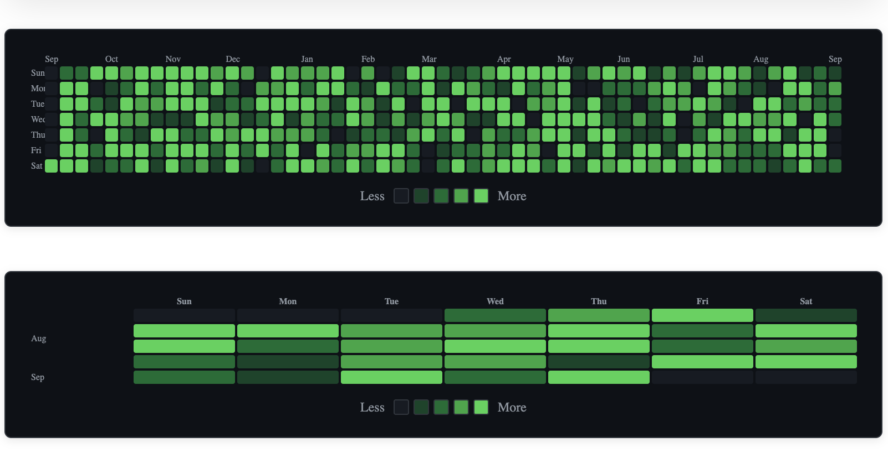

[](https://www.npmjs.com/package/@pearpages/heatmap)
[](https://github.com/pearpages/heatmap/actions)
[](LICENSE)
[](https://www.npmjs.com/package/@pearpages/heatmap)

# Heatmap

React component that "copies" the style of _Github_ for showing heatmaps.

[Demo](heatmap.pearpages.com)



## Getting started

When using the library, make sure to import the CSS file:

```tsx
import '@pearpages/heatmap/styles.css';
```

This ensures that all necessary styles are applied to the heatmap components.
