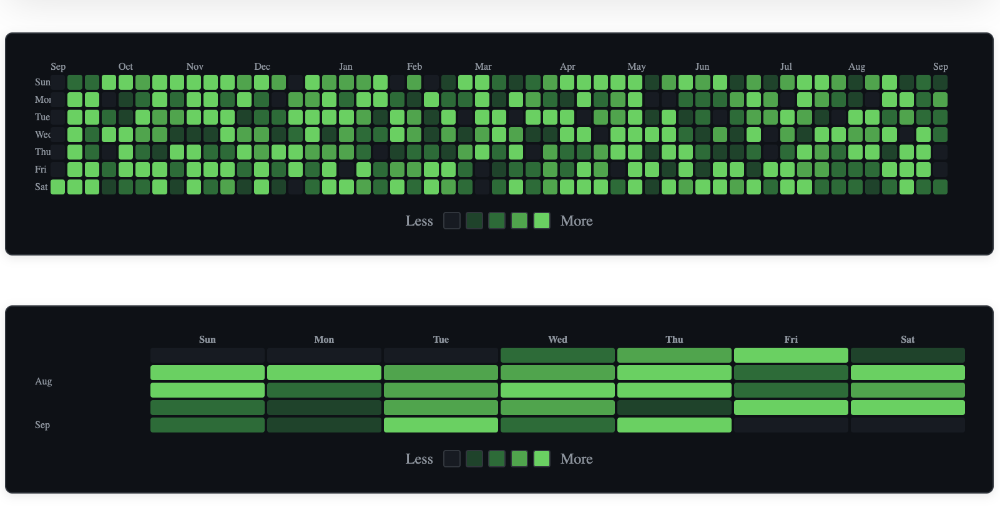

[](https://www.npmjs.com/package/@pearpages/heatmap)
[](https://github.com/pearpages/heatmap/actions)
[](LICENSE)
[](https://www.npmjs.com/package/@pearpages/heatmap)

# Heatmap

React component that "copies" the style of _Github_ for showing heatmaps.

[Demo](https://heatmap.pearpages.com)



## Installation

```bash
npm install @pearpages/heatmap
```

`react` and `react-dom` (`^19.1.1`) are **peer dependencies** — the package does not
bundle them. The package is **ESM only**.

## Getting started

When using the library, make sure to import the CSS file:

```tsx
import '@pearpages/heatmap/styles.css';
```

This ensures that all necessary styles are applied to the heatmap components.

## Usage

```tsx
import {
  ContributionHeatmap,
  groupByWeeks,
  type ContributionData,
  type Period,
} from '@pearpages/heatmap';
import '@pearpages/heatmap/styles.css';

const period: Period = {
  start: new Date('2024-01-01'),
  end: new Date('2024-12-31'),
};

const contribution: ContributionData[] = [
  { date: '2024-01-01', count: 3, level: 2 },
  { date: '2024-01-02', count: 0, level: 0 },
  // ...one entry per day
];

function MyHeatmap() {
  return (
    <ContributionHeatmap
      data={{ contribution, period, weeks: groupByWeeks(contribution) }}
    />
  );
}
```

### The `level` contract

`level` is **caller-supplied** and is what drives the cell colour — the component does
not derive it from `count`. You decide how your counts map onto the five buckets.

For reference, these are the thresholds the bundled mock generator uses:

| count | level |
| --- | --- |
| `0` | `0` |
| `1–2` | `1` |
| `3–5` | `2` |
| `6–8` | `3` |
| `9+` | `4` |

### Data shape

`groupByWeeks` turns a flat, day-per-entry array into the `Week[]` the component renders.
It pads out to the enclosing Sunday…Saturday and fills any missing day with
`{ count: 0, level: 0 }`, so gaps in your input are safe.

Two period helpers are exported for the common cases:

```tsx
import { getLastYearPeriod, getLastMonthPeriod } from '@pearpages/heatmap';
```

To try the component out without wiring up real data:

```tsx
import { generateMockData, getLastYearPeriod } from '@pearpages/heatmap';

const period = getLastYearPeriod();
const contribution = generateMockData({ period, isRealistic: true });
```

`isRealistic: true` produces weekday-weighted data — quieter weekends, a summer lull in
June–August, and the occasional spike. `false` is uniform random.

### Ready-made demo

The interactive demo used on the [demo site](https://heatmap.pearpages.com) — theme
switcher, sample-data toggle, and both layouts — ships as a separate entry point, so it
stays out of your bundle unless you ask for it:

```tsx
import { ContributionHeatmapExample } from '@pearpages/heatmap/example';
import '@pearpages/heatmap/example.css';
```

`example.css` is a **superset** of `styles.css` — import one or the other, not both.

## Props

`ContributionHeatmap`:

| Prop | Type | Default | Notes |
| --- | --- | --- | --- |
| `data.contribution` | `ContributionData[]` | required | Flat, one entry per day |
| `data.period` | `Period` | required | `{ start: Date; end: Date }`. Drives the month headers and whether a tooltip reads as in-range |
| `data.weeks` | `Week[]` | required | 7-item tuples, Sunday-first — use `groupByWeeks` |
| `className` | `string` | `''` | Appended to the root element; this is how themes are applied |
| `isReverse` | `boolean` | `false` | Vertical layout: one row per week, weekdays as columns |

Each cell is a `<td>` carrying `data-count`, `data-date`, a
`contribution-heatmap__day--level-N` class, and a `title` / `aria-label` tooltip.

## Themes

Four palettes ship with the library. Apply one through `className`:

```tsx
<ContributionHeatmap className="contribution-heatmap--ocean" data={...} />
```

| Theme | `className` |
| --- | --- |
| GitHub (default) | _none_ |
| Ocean | `contribution-heatmap--ocean` |
| Sunset | `contribution-heatmap--sunset` |
| Purple | `contribution-heatmap--purple` |

Themes are nothing more than overrides of the `--color-level-0` … `--color-level-4`
custom properties, so you can define your own the same way:

```css
.contribution-heatmap--brand {
  --color-level-0: #eee;
  --color-level-1: #cfe8ff;
  --color-level-2: #7cc0ff;
  --color-level-3: #3b93f0;
  --color-level-4: #0b5cad;
}
```

Dark mode is automatic via `prefers-color-scheme` — there is no prop or toggle.

## Local development

```bash
npm install          # workspace root; installs demo/ too
npm run demo         # the sandbox, resolving the library from src/ (HMR)
npm run build        # build dist/
npm test -- --run    # run the test suite once
npm run lint
npm run check:package  # publint + arethetypeswrong
```

`demo/` is a single Vite app that serves as both the development sandbox and the site
deployed to [heatmap.pearpages.com](https://heatmap.pearpages.com). It imports the library
by its public specifier (`@pearpages/heatmap/example`) and resolves it two ways:

| Command | Resolves to | Use for |
| --- | --- | --- |
| `npm run demo` | `../src` — HMR, no build step | working on the component |
| `npm run demo:dist` | `../dist` through the package's `exports` map | checking what a consumer installs |

`npm run demo:dist` rebuilds the library first. Because one `App.tsx` serves both modes,
they can't drift: if they render differently, the packaging is wrong.

`npm run check:package` is the automated version of that check — `publint` and
`arethetypeswrong` validate the `exports` map, the `files` field and the `.d.ts`
resolution. It runs in `publish.yml` and in `prepublishOnly`.

## Releasing

There are two **independent** pipelines. Knowing which one a push triggers is the whole
game:

| Trigger | Workflow | Effect |
| --- | --- | --- |
| Push to `main` | `.github/workflows/deploy.yml` | Runs the tests, builds the library + `demo/`, deploys to GitHub Pages. **Never touches npm.** |
| Push a `v*` tag | `.github/workflows/publish.yml` | Builds and publishes to npm with provenance |

So you can push to `main` freely — nothing reaches npm until a `v*` tag is pushed.

### The happy path

```bash
npm version minor          # bumps package.json, commits, and tags vX.Y.Z
git push --follow-tags     # pushes main (deploys the demo) and the tag (publishes to npm)
```

### Four things that are easy to get wrong

1. **The tag name does not set the published version.** `publish.yml` just runs
   `npm publish`, which reads the version out of `package.json`. Tagging `v0.3.0` while
   `package.json` still says `0.2.0` fails with a 403
   (`cannot publish over previously published version`). Use `npm version`, which keeps
   the two in sync for you.
2. **A plain `git push` does not push tags.** Use `git push --follow-tags`, or push the
   tag explicitly with `git push origin vX.Y.Z`.
3. **The main-branch guard skips rather than fails.** Every step in `publish.yml` is gated
   on `git merge-base --is-ancestor $GITHUB_SHA origin/main`. If the tag is not on `main`,
   all steps skip and the job still reports **green** — it now emits a workflow warning
   saying why, but it is still a green run with nothing published.
4. **The demo advertises the new version before npm has it.** `demo/src/App.tsx`
   renders the version read from the root `package.json`, and the Pages deploy runs on
   push to `main`. The site therefore shows the bumped version as soon as the bump commit
   lands — before the tag exists, and before npm has anything.
